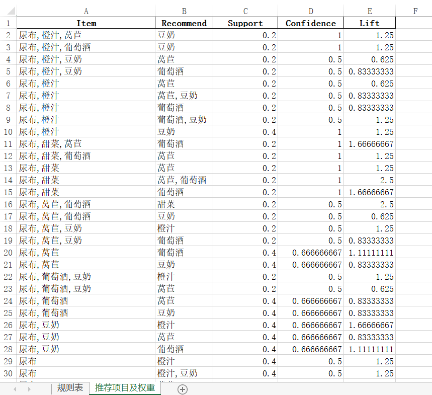
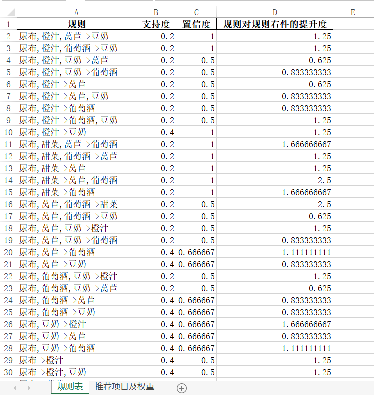

# 关联规则分析：Apriori算法

## 数据介绍

`./data/data.xlsx` 是原始数据

`./data/transaction.xlsx` 是 `./data/data.xlsx`经过处理后的数据，具体是执行`./src/process.py`

`./data/result.xlsx` 是 `./data/transaction.xlsx` 经过算法执行后的结果，具体是运行`./src/Apriori.py`，但需要将程序中的输入数据路径和输出路径做相应的更改

`./data/transaction2.xlsx` 是另一个数据集，经过算法执行后的结果存储在`./data/result2.xlsx`，但需要将程序中的输入数据路径和输出路径做相应的更改

## 结果展示

### transaction.xlsx 关联规则分析后的结果


## transaction2.xlsx 关联规则分析后的结果





## Apriori算法总结

关联分析是用于发现大数据集中元素间有趣关系的一个工具集，可以采用两种方式来量化这些有趣的关系：

1. 第一种方式是使用频繁项集，它会给出经常在一起出现的元素项；
2. 第二种方式是使用关联规则，每条关联规则意味着元素项之间的“如果....那么...”关系

发现元素项间不同的组合是个十分耗时的任务，不可避免需要大量昂贵的计算资源，这就需要一些更智能的方法在合理的时间范围内找到频繁项集。能够实现这一目标的一个方法是Apriori算法，它使用Apriori原理来减少在数据库上进行检查的集合的数目。

**Apriori原理**是说：<font color='red'>如果一个元素项是不频繁的，那么那些包含该元素的超集也是不频繁的。</font>

Apriori算法从单元素项集开始，通过组合满足最小支持度要求的项集来形成更大的集合。<font color='red'>支持度用来度量一个集合在原始数据中出现的频率。</font>

关联分析可以用在许多不同物品上。商店中的商品以及网站的访问页面是其中比较常见的例子。关联分析也曾用于查看选举人及法官的投票历史。


## Apriori算法的不足

每次增加频繁项集的大小，Apriori算法都会重新扫描整个数据集。当数据集很大时，这会显著降低频繁项集发现的速度。例如，在`./src/Apriori.py`中第224行代码：

```

for key in transaction:


```

其中transaction是存储交易记录的临时数据集，相当于原数据集的一份拷贝。在每次生成新的频繁项集时都要遍历一次数据库。

FPGrowth算法和Apriori算法相比，该算法只需要对数据库进行两次遍历，能够显著加快发现频繁项集的速度。